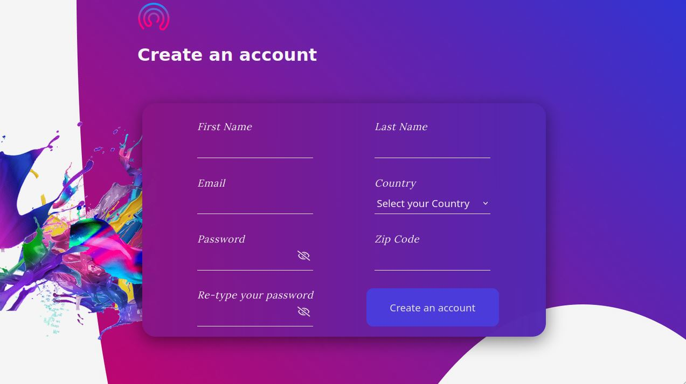

# Login Form



A sample, responsive login form, based on the Validation Constraint API. Built mobile-first, it features data validation, based on both the API and JS regex. Additionally, there is dynamic styling based on the viewport, along with GSAP animations when loading.

The main goal of this project was to become more familiar with the API and also learn more about GSAP, ES6 modules, Webpack and Babel.

## Installation

After cloning, it would be essential to install the dependencies:

```cli
npm install
```

Creating the /dist directory requires building:

```cli
npm run build
```

`watch` has also been configured and is run with:

```cli
npm run watch
```

## Features

- GSAP Animations
- Field validation (both API-related and regex-based)
- SVG-based animations

## Tech

- JavaScript
- Webpack
- GSAP
- FontAwesome
- JS-Confetti

For a more detailed overview of the dependencies, please check `package.json`.

## Contributing

Contributions are certainly welcome. Please feel free to open an issue/PR if there is something you would like to be changed.

Acknowledgements
A massive thank you to The Odin Project & freeCodeCamp community, as their guidance and learning process have been invaluable.

## License

[MIT](./LICENSE.md)
